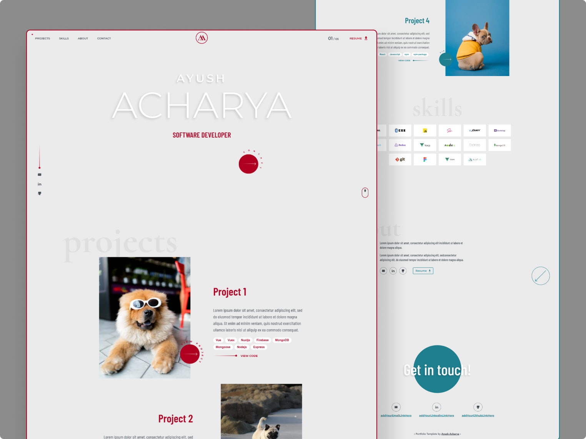

<h2 align="center">
    <a href="https://github.com/jash139/">
        
    </a>
    <br/>
    <a href="https://portfolio-website-template.netlify.app/">portfolio-website-template.netlify.app</a>
</h2>

<div align="center">
    
</div>

<br/>

Portfolio Template by [Ayush Acharya](https://github.com/jash139/) developed using Reactjs with easy setup.
<br />
Just modify your relevant details in `config.js` file, add your resume and projects,
your Portfolio Website is good to go!

# Table of contents

* [Installation and Setup](#installation-and-setup)
* [Usage Instructions](#usage-instructions)
    * [Details](#details)
    * [Projects](#projects)
    * [Resume](#resume)
    * [Skills](#skills)
    * [Themes](#themes)
    * [Other minor changes](#other-minor-changes)
* [Deployment](#deployment)
* [Contributing](#contributing)

## Installation and Setup

* Fork the repository
* Clone and create your branch
* Open the project and run following commands for setup

```bash
# install dependencies
npm install

# serve with hot reload at localhost:3000
npm start
```

## Usage Instructions

### Details

Update your `contactLinks` and `personalDetails` in `config.js`.

```jsx
const contactLinks = {
    email: "",
    linkedin: "",
    github: "",
};

const personalDetails = {
    myName: {
        first: "",
        last: ""
    },
    title: "",
    about: {
        para1: "",
        para2: ""
    }
};
```

### Projects

Add comma separated projects to `projectDetails` in `config.js` with following format:

```jsx
const projectDetails = [
    {
        title: "",
        description: "",
        image: "",
        hostedLink: "",
        githubLink: "",
        techStack: [],
    }
];
```

For project `image` add your project image to `images` folder in `src` directory and specify the same in the `projectDetails`.
<br />
Example:
`~/src/images/myProjectImage.PNG`

```jsx
const projectDetails = [
    {
        ...
        image: "myProjectImage.PNG",
        ...
    }
];
```

### Resume

Add your resume to `resume` directory. Make sure to keep your resume name as `resume.pdf`.


### Skills

Add your skills to `mySkills` in `config.js` file.

Check the table below for your relevant skills. The app currently supports following mentioned skills, however you can add more skills with their `SVGs` in `SkillsCard.js` component.

#### List of Skills

| Skill           |
| --------------- |
| `html`          |
| `css`           |
| `javascript`    |
| `jquery`        |
| `sass`          |
| `bootstrap`     |
| `react`         |
| `redux`         |
| `vue`           |
| `vuex`          |
| `nuxtjs`        |
| `nodejs`        |
| `expressjs`     |
| `mongodb`       |
| `git`           |
| `figma`         |

You can also pass skills not mentioned in the table, but the card will be shown as text instead of the logo.

### Themes

You can customize the appearance of your Portfolio to your choice by providing primary and secondary colors to `themeColors` in `config.js` file.

```jsx
const themeColors = {
    primaryColor: "",
    secondaryColor: "",
    ...
};
```

### Other minor changes

Do the following to truly make the Portfolio your own.

* Change the `favicon.ico` in `public` directory
* Change the details in `index.html` in `public` directory to reflect your details

## Deployment
Run build command with publish directory as `build`.

```bash
# build command
npm run build
```

My [website](https://ayushacharya.netlify.app/) is deployed on netlify. Refer [Deploy React App](https://www.netlify.com/blog/2016/07/22/deploy-react-apps-in-less-than-30-seconds/) on how to deploy on netlify.

## Contributing
Follow below steps to contribute and help improve the template.

* Fork the repository
* Create your branch 
* Commit changes
* Push to the branch
* Open a pull request